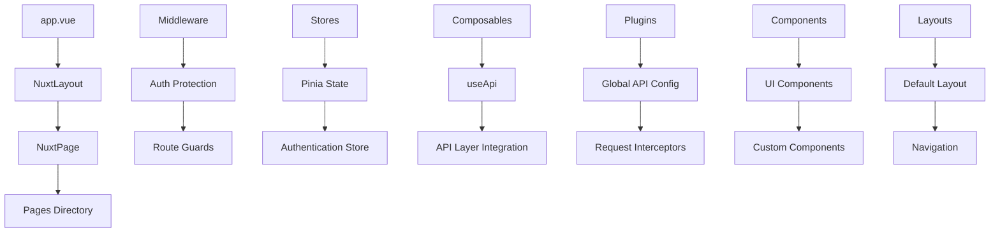
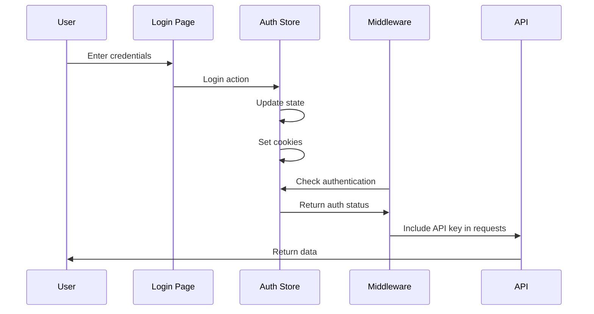
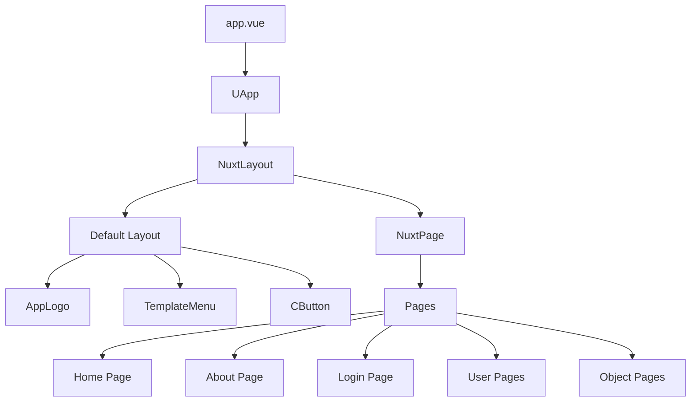

# Knowledge: App Folder Structure

## Overview

The `app/` folder is the core application directory of a Nuxt.js 4 project built with TypeScript, featuring a modern Vue.js architecture with Nuxt UI components. This is a production-ready starter template that demonstrates best practices for building scalable web applications.

**Key Characteristics:**

- **Language**: TypeScript with Vue 3 Composition API
- **Framework**: Nuxt.js 4 with Nuxt UI
- **State Management**: Pinia with persistence
- **Authentication**: Cookie-based with middleware protection
- **API Integration**: Custom API layer with external service integration
- **UI System**: Nuxt UI with custom theming and components

## Implementation Details

### Core Application Structure

The application follows Nuxt.js conventions with a well-organized directory structure:

```
app/
├── app.vue              # Root application component
├── app.config.ts        # Application configuration
├── error.vue           # Global error handling
├── pages/              # File-based routing
├── components/         # Reusable Vue components
├── layouts/            # Page layout templates
├── middleware/         # Route middleware
├── composables/        # Vue composables
├── stores/             # Pinia state management
├── plugins/            # Nuxt plugins
├── constants/          # Application constants
├── utils/              # Utility functions
└── assets/             # Static assets
```

### Key Components and Patterns

#### 1. Application Entry Point (`app.vue`)

```vue
<template>
  <UApp>
    <NuxtLayout>
      <NuxtPage />
    </NuxtLayout>
  </UApp>
</template>
```

- Uses Nuxt UI's `UApp` wrapper for consistent theming
- Implements layout system with `NuxtLayout`
- File-based routing with `NuxtPage`

#### 2. Configuration (`app.config.ts`)

- Custom UI theme configuration with violet primary colors
- Rounded component styling (buttons, cards, inputs)
- Centralized design system configuration

#### 3. Authentication System

**Store (`stores/auth.ts`)**:

- Pinia store with cookie persistence
- Demo authentication with hardcoded credentials
- State management for email and API key

**Middleware (`middleware/auth.global.ts`)**:

- Global route protection
- Automatic redirect logic
- API key validation
- Redirect logic for authenticated/unauthenticated users

#### 4. API Integration

**Composable (`composables/useApi.ts`)**:

- Custom API layer for external service integration
- Token-based authentication with sessionStorage
- Base URL configuration for API Layer service

**Plugin (`plugins/api.ts`)**:

- Global API configuration with interceptors
- Request/response logging
- Error handling for API calls

#### 5. UI Components

**Custom Components**:

- `AppLogo.vue`: SVG logo component with CSS variables
- `TemplateMenu.vue`: Navigation component
- `CButton/`: Custom button component with loading states

**Layouts**:

- `default.vue`: Main layout with navigation and custom styling
- `custom.vue`: Alternative layout option

### Data Flow and State Management

1. **Authentication Flow**:
   - User login → Store state update → Cookie persistence
   - Middleware checks authentication on route changes
   - API calls include authentication headers

2. **Component Communication**:
   - Composables for shared logic (`useApi`, `useFoo`)
   - Pinia stores for global state
   - Props and events for component communication

3. **Routing**:
   - File-based routing in `pages/` directory
   - Middleware for route protection
   - Layout system for consistent UI structure

## Dependencies

### External Dependencies

- **Nuxt.js 4**: Core framework
- **Vue 3**: Frontend framework
- **TypeScript**: Type safety
- **Pinia**: State management
- **Nuxt UI**: Component library
- **VueUse**: Vue composition utilities
- **Axios**: HTTP client
- **Valibot/Zod**: Schema validation

### Internal Dependencies

- **Constants**: Authentication credentials and configuration
- **Utils**: Helper functions for query management and styling
- **Composables**: Reusable Vue composition functions
- **Stores**: Global state management
- **Middleware**: Route protection and navigation logic

### API Dependencies

- **API Layer**: External service integration
- **Session Storage**: Client-side token storage
- **Cookies**: Persistent authentication state

## Visual Diagrams

### Application Architecture



### Authentication Flow



### Component Hierarchy



## Additional Insights

### Strengths

1. **Modern Architecture**: Uses latest Nuxt.js 4 with TypeScript
2. **Component System**: Well-structured with reusable components
3. **State Management**: Proper Pinia integration with persistence
4. **Authentication**: Secure middleware-based route protection
5. **API Integration**: Clean separation of concerns with composables
6. **UI Consistency**: Nuxt UI with custom theming

### Potential Improvements

1. **Security**: Hardcoded API keys should be environment variables
2. **Error Handling**: More comprehensive error boundaries
3. **Testing**: No test files present in current structure
4. **Documentation**: Could benefit from more inline documentation
5. **Performance**: Consider lazy loading for heavy components

### Security Considerations

- API keys are hardcoded (should use environment variables)
- Authentication relies on client-side storage
- No CSRF protection visible
- Session management could be more robust

### Performance Considerations

- Uses ISR (Incremental Static Regeneration) for home page
- Component lazy loading in layouts
- Optimized with Nuxt.js automatic code splitting
- Tailwind CSS for efficient styling

## Metadata

- **Analysis Date**: 2025-01-27
- **Analysis Depth**: Level 3 (comprehensive)
- **Files Analyzed**: 15+ core files
- **Dependencies Traced**: 20+ internal and external dependencies
- **Architecture Pattern**: Nuxt.js with Vue 3 Composition API

## Next Steps

### Immediate Actions

1. Move hardcoded API keys to environment variables
2. Add comprehensive error handling
3. Implement proper testing structure
4. Add API documentation

### Future Enhancements

1. Consider implementing proper authentication backend
2. Add monitoring and logging
3. Implement proper CI/CD pipeline
4. Add performance monitoring
5. Consider implementing PWA features

### Related Areas for Analysis

- `/docs/ai/requirements/` - Review project requirements
- `/docs/ai/design/` - Check architectural decisions
- `/docs/ai/testing/` - Implement testing strategy
- `/docs/ai/deployment/` - Plan deployment architecture

### Suggested Follow-up Captures

- `/capture-knowledge app/pages/` - Deep dive into routing structure
- `/capture-knowledge app/stores/` - Analyze state management patterns
- `/capture-knowledge app/composables/` - Review composable architecture
